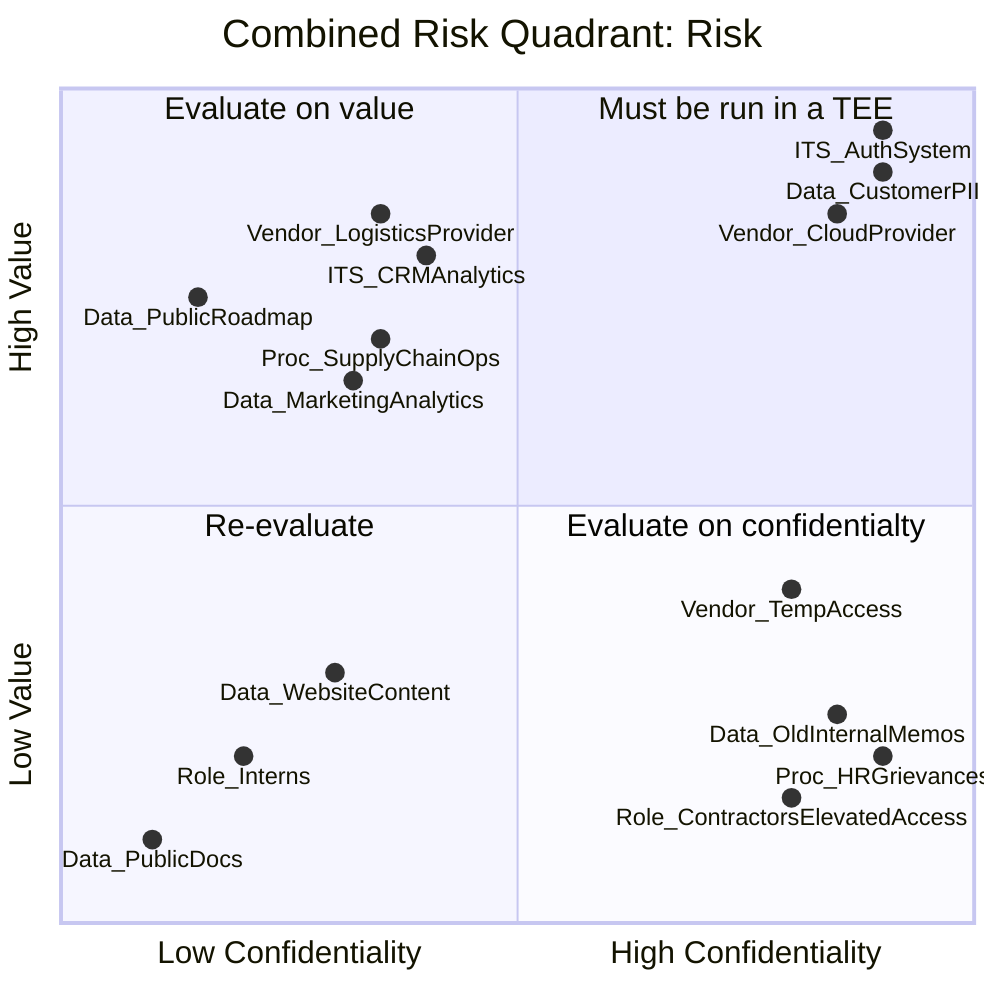

# Diagrams

I wanted to tryout some of the different options as alternative to PlantUML, as I am prepping for a presentation about CoCo for a CNCF meetup.

## MermaidJS
I've addded [Astro Mermaid](https://starlight-mermaid-demo.netlify.app) to this site,

>Basic flow


>Risk Like for confidential compute


## D2

I've been playing with D2...

```d2 sketch pad=50
direction: right

Fork

PR.A
PR.B
Branch

Fork -> Branch.A
Branch.A <-> Branch.A: lots of messy commits {style.animated: true}
Branch.A -> Branch.B: Sqash cherry picked files from A to B
Branch.B -> PR.A: clean single commit
Branch.A -> Branch.C: Sqash wanted files from A to PR.B
Branch.C -> PR.B: clean single commit

PR.A -> Fork origin
PR.B -> Fork origin
```
